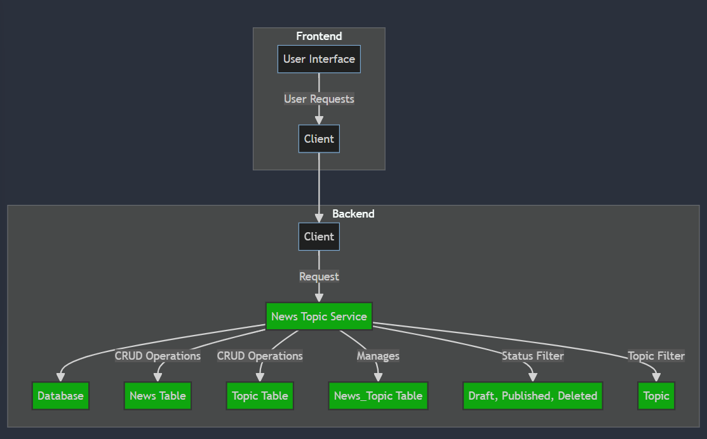
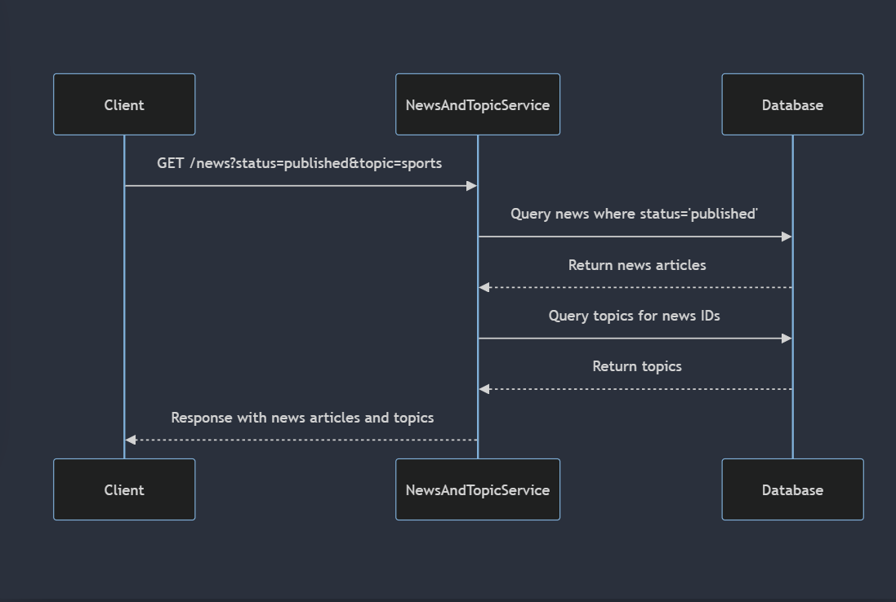
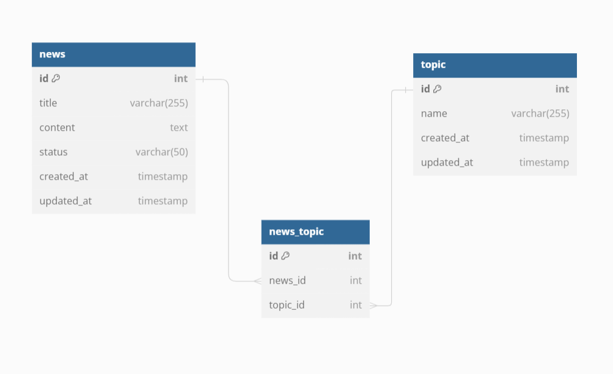
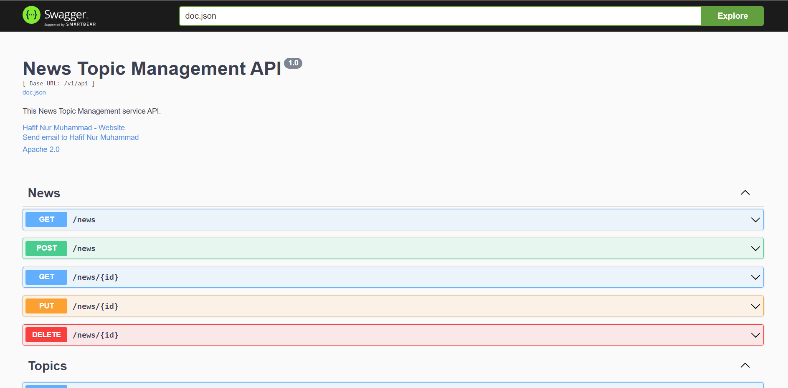
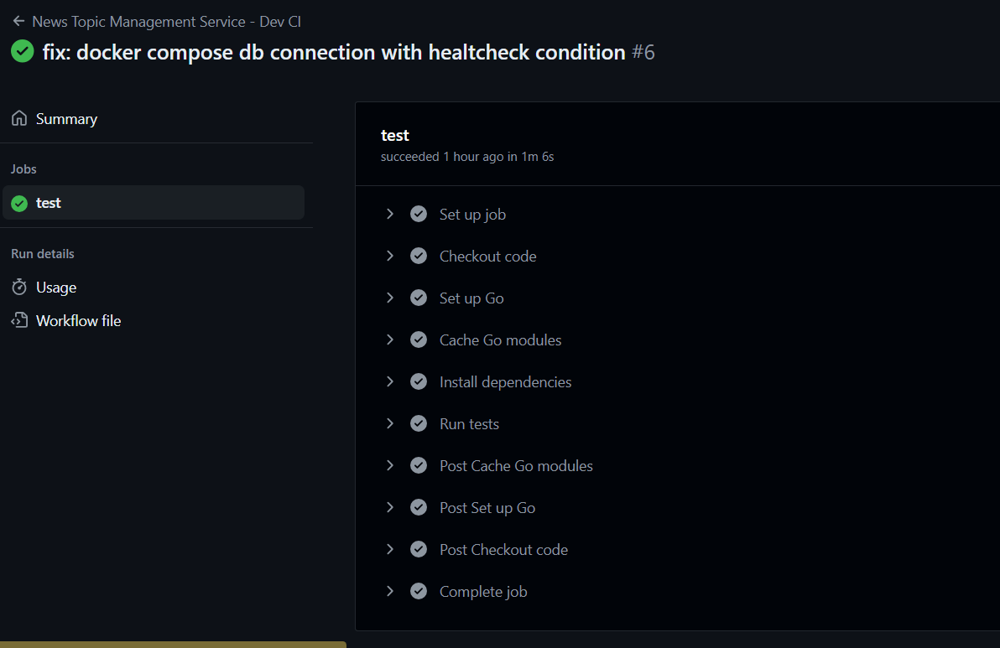

## News Topic Management Service API - v1.0.0.

#### This a Restful API that contains several Endpoints for manage News and Topic

## About the Project
### System Design Architecture

- This is the End to end of user flow diagram that describe the system design itself, you can refer to system-design-diagram.md file in the root path of the project to see the full markdown
    -   
- This is the Example of Request Coming from client and then forwarded to the server then server give the response based on the request.
    -   
### Entity Relationship Diagram (ERD)
- This is the ERD design about all entity's in this service. News and Topic have a many2many relation, so to handle that relation we need bridge / helper table to store the related Topics that belongs to News and vice versa. Again for more detail you can look the full markdown in erd-design.dbml
    -   

### API Documentation
- For API Docs, I used swagger to generate the docs, you can simply go to the http://localhost:3333/swagger to access the API docs
    -   

### CI Workflow with Github Action
- This a CI Pipeline for development purpose. So I set a CI Workflow with github action to trigger the unit test in all layer (Controller, Service, and Repository) every push or PR (Pull Request)
  -   

## Feature of the Project

### All the tech or feature that I used in this project
- [x] Golang as the programming language
- [x] Chi as the routing framework
- [x] PostgresSQL as the database
- [x] GORM as the ORM
- [x] Open API / Swagger as the API Docs
- [x] Mermaid js for the system design Diagram
- [x] DBML as the Database Docs
- [x] Unit Test 
- [x] Clean Architecture as the Software Paradigm
- [x] CI Workflow with Github Action
- [x] Go Air for Hot Reload - Enhance Developer Experience
- [x] Docker for the Containerization 

## How To run the project

1. Run Locally
   1. Using Make
      1. Install make build tools first
      2. Then just run make run, congrats you can use this API Service
   2. Using Manual Way
      1. Install air go for Hot Reload `go install github.com/air-verse/air@latest`
      2. Then run `go mod tidy`
      3. Then run `air`, congrats you can use this API Service
2. Run with Docker
   1. Install Docker first
   2. In the root path of this project, run `docker compose up -d`
   3. Then you can use this API Service
3. Run the seeder to initiate the dummy data
   1. Run this in terminal `make seed`
4. If you want to run all the unit test, then you can run the `make run-test` command in the terminal
5. You can hit the Base URL of this API Service 
   1. `http://localhost:3333/v1/api/news`
   2. `http://localhost:3333/v1/api/topic`

#### Bonus Tip
- For the simplicity, you can import the postman collection that I provide in `docs->postman` folder of this project
