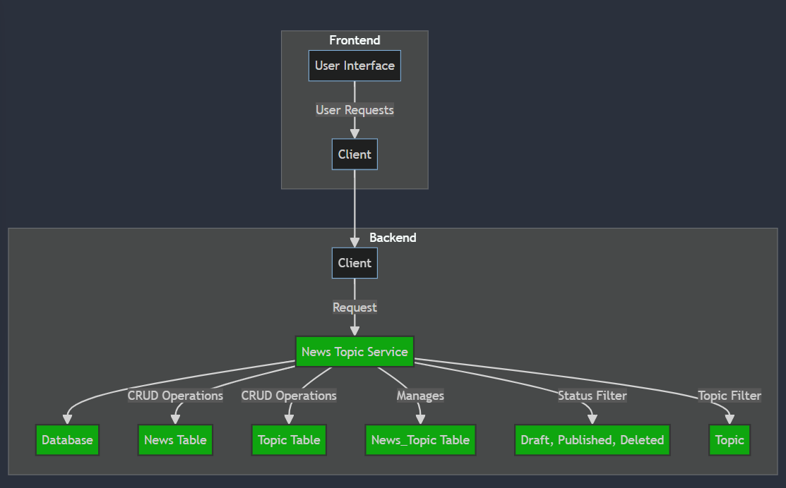
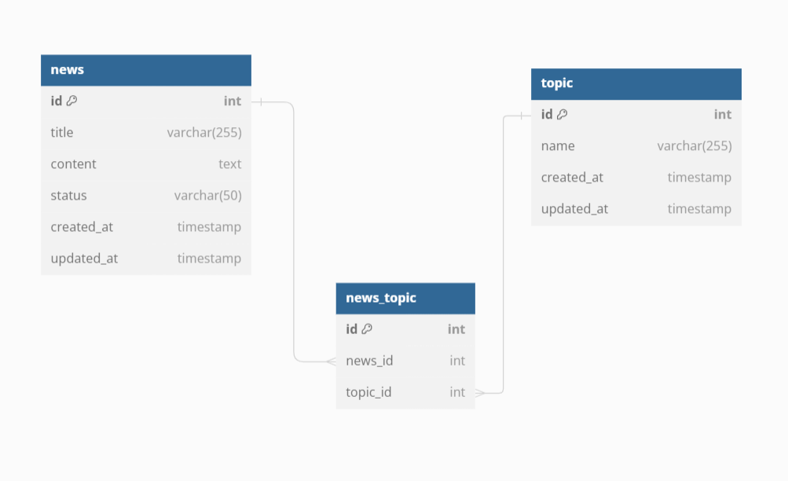

## News Topic Management Service API - v1.0.0.

#### This a Restful API that contains several Endpoints for manage News Topic

### System Design Architecture

- This is the End to end of user flow diagram that describe the system design itself, you can refer to system-design-diagram.md file in the root path of the project to see the full markdown
    -   

### Entity Relationship Diagram (ERD)
- This is the ERD design about all entity's in this service. News and Topic have a many2many relation, so to handle that relation we need bridge / helper table to store the related Topics that belongs to News and vice versa. Again for more detail you can look the full markdown in erd-design.dbml
    -   

### API Documentation
- For API Docs, I used swagger to generate the docs, you can simply go to the http://localhost:3333/swagger to access the API docs
    -   

