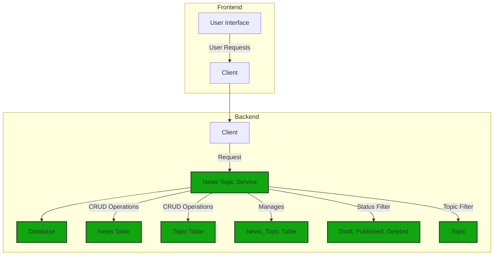

```mermaid
graph TD
    subgraph Backend
        A[Client] -->|Request| B[News Topic Service]

        B --> E[Database]

        B -->|CRUD Operations| F[News Table]
        B -->|CRUD Operations| G[Topic Table]
        B -->|Manages| H[News_Topic Table]

        B -->|Status Filter| I[Draft, Published, Deleted]
        B -->|Topic Filter| J[Topic]
    end

    subgraph Frontend
        K[User Interface] -->|User Requests| L[Client]
    end

    L --> A

    classDef service fill:#0FA60F,stroke:#333,stroke-width:2px;
    class B,E,F,G,H,I,J service;
```
